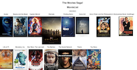
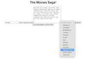

# Weekend-movie-saga

## Description

Duration: 2 day sprint

For this movie saga project we had to be able to add a movie containing the movie name, a url, a description and be able to select a genre (with a drop down menu with 13 genres) and be able to add this information to our data base. Once added the url image and title of the movie would be displayed on the home page.

Once on the home page you would be able to click on the movie image and it would bring you to a details page. The details that were added when adding a new movie would be displayed here. 

### Screen Shots

### Prerequisites
Node.js
PostgreSQL

### Installation
If your application has secret keys (for example -- Twilio), make sure you tell them how to set that up, both in getting the key and then what to call it in the .env file.

1. Create a database named "saga_movies_weekend".
2. The queries in the database.sql file are set up to create all the necessary tables and populate the needed data to allow the application to run correctly. 
3. The project is built on Postgres, so you will need to make sure to have that installed. We recommend using Postico to run those queries as that was used to create the queries,
4. Open up your editor of choice and run an npm install
5. Run npm run server in your terminal
6. Run npm run client in your terminal
7. The npm run client command will open up a new browser tab for you!
### Built With
- React, Redux, JavaScript, SQL, Node.js, Express.js,HTML
### Acknowledgment
Thank you to Prime Digital Academy, my instructor Mat Black, and my cohort who helped me to create this application.

### Support
If you have suggestions or issues, please email me at nick.ilacqua@yahoo.com

